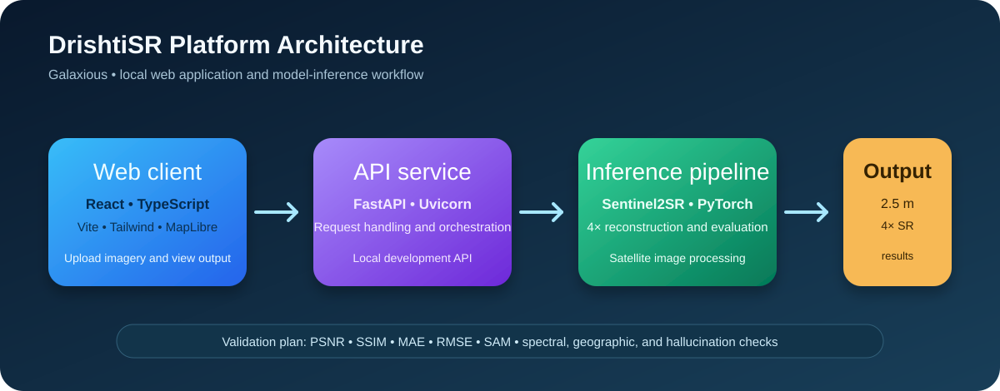

<div align="center">


# DrishtiSR

### AI-powered 4× super-resolution for Sentinel-2 satellite imagery

[](https://www.sih.gov.in/)


*Turning medium-resolution Sentinel-2 observations into a finer, model-reconstructed 2.5 m product—while keeping the scientific limits of super-resolution visible.*

</div>

> **Research note:** Super-resolution reconstructs plausible fine detail from learned patterns; it is not a substitute for a direct 2.5 m satellite observation. Outputs should be validated before high-stakes geospatial use.

## Why DrishtiSR?

Sentinel-2 provides globally useful, openly available imagery at 10 m resolution, but many planning and mapping workflows need more local detail. Conventional interpolation can enlarge an image, but it cannot learn the spatial patterns present in paired high-resolution reference imagery.

DrishtiSR is a deep-learning super-resolution project for **4× spatial enhancement: 10 m → 2.5 m**. It learns from paired low-/high-resolution samples using the **Sentinel2SR** architecture and a joint **pixel + spectral** objective.

## At a glance

| Item | Current project fact |
| --- | --- |
| Input | Sentinel-2 imagery at 10 m resolution |
| Output | 2.5 m reconstructed imagery (4× spatial scale) |
| Training data | Paired low-/high-resolution samples from SEN2NAIPv2 |
| Model | Sentinel2SR |
| Objective | Pixel reconstruction loss + spectral consistency loss |
| Reported held-out result | **PSNR: 33.607 dB** |
| License | MIT |

## End-to-end pipeline


<details>
<summary><strong>How to read the flow</strong></summary>

1. **Input:** Sentinel-2 provides the 10 m source imagery.
2. **Learning signal:** paired low-/high-resolution samples teach the network the desired 4× mapping.
3. **Model:** Sentinel2SR predicts the finer grid.
4. **Losses:** pixel loss rewards reconstruction fidelity; spectral loss helps preserve inter-band relationships.
5. **Output:** a 2.5 m model-reconstructed image, evaluated with standard image-quality metrics.
</details>

## Model and training

### Sentinel2SR architecture

The project uses **Sentinel2SR**, a super-resolution network trained to map low-resolution Sentinel-2 patches to their higher-resolution counterparts. The model is optimized with two complementary signals:

- **Pixel loss** — encourages accurate per-pixel reconstruction.
- **Spectral loss** — encourages consistency between spectral responses, an important constraint for satellite imagery.

### Data

Training and evaluation use paired samples from **SEN2NAIPv2**. Pairing the low-resolution and higher-resolution observations lets the model learn a supervised 4× mapping rather than relying on interpolation alone.

The current experimental run uses a **300-sample subset**. The next training phase targets **50,000 samples**; its results will be reported separately once that run and its evaluation are complete.

## Results

The current held-out test run reports:

<div align="center">

| Metric | Result |
| :--- | ---: |
| **PSNR** | **33.607 dB** |

</div>

PSNR measures reconstruction fidelity in decibels; it is **not a percentage improvement**. A direct “improvement over bicubic” claim should only be added after the same test subset has been evaluated with the bicubic baseline.

<!--
When you have images, replace this comment with real, versioned project assets:

<p align="center">
  
</p>

Recommended comparison order: 10 m input | bicubic 4× | DrishtiSR 4× | paired reference.
-->

## Application architecture

<p align="center">
  
</p>

| Layer | Stack / responsibility |
| --- | --- |
| Frontend | React, TypeScript, Vite, Tailwind CSS, and MapLibre for the web experience and map display |
| Backend | FastAPI served with Uvicorn |
| AI / ML | Python, PyTorch, NumPy, OpenCV, and scikit-image for model work and image evaluation |
| Geospatial | Rasterio, GDAL, GeoPandas, Shapely, and PyProj for geospatial processing |
| Evaluation plan | PSNR, SSIM, MAE, RMSE, and SAM, supplemented by spectral and geographic checks |

## Run locally

Open **two terminals** from the repository root. The frontend and backend should run at the same time.

### Terminal 1 — frontend

```bash
cd frontend
npm run dev
```

### Terminal 2 — backend

```bash
cd backend
python -m uvicorn app.main:app --reload
```

Before starting, install the frontend dependencies and activate the backend Python environment. These commands use the team’s actual project entry points: `frontend` and `backend/app/main.py`.

> **Contributor note:** Push the frontend and backend source, dependency files, and environment-variable instructions before asking others to run the project. Do not commit API keys, data credentials, or large training data.

## Repository layout

This layout reflects the intended project organization. Keep the README synchronized as implementation files are pushed to the public repository.

```text
.
├── ai/             # Model architecture, training, and inference code
├── backend/        # FastAPI service; start with Uvicorn
├── config/         # Experiment/configuration files
├── data/
│   ├── raw/        # Source data (not committed)
│   ├── processed/  # Derived data (not committed)
│   ├── train/      # Training split (not committed)
│   ├── val/        # Validation split (not committed)
│   └── test/       # Test split (not committed)
├── deployment/     # Deployment configuration (to be added)
├── experiments/    # Experiment logs and evaluation summaries (to be added)
├── frontend/       # React web client; start with npm run dev
├── geospatial/     # Geospatial utilities (to be added)
├── models/         # Checkpoint documentation/download instructions (to be added)
├── notebooks/      # Exploratory and training notebooks (to be added)
├── reports/        # Figures and reports (to be added)
├── scripts/        # Reproducible training/evaluation commands (to be added)
├── tests/          # Automated checks and evaluation tests
├── assets/         # README visuals
└── README.md
```

## Getting started

```bash
git clone https://github.com/Spideyxperince/DrishtiSR-AI-Satellite-SuperResolution.git
cd DrishtiSR-AI-Satellite-SuperResolution
```

## Validation plan

The team plans to test outputs beyond visual sharpness. Add each check as reproducible code and a result table when completed.

| Validation area | Planned check | Why it matters |
| --- | --- | --- |
| Reconstruction quality | PSNR, SSIM, MAE, RMSE | Measures image fidelity and structural preservation |
| Spectral fidelity | SAM and band-consistency checks | Helps detect changes to multispectral relationships |
| Geographic integrity | CRS, alignment, transform, and boundary checks | Confirms that the output remains usable in GIS workflows |
| Hallucination risk | Confidence and consistency screening | Flags details that require human review |
| Baseline comparison | Bicubic evaluation on the same held-out split | Establishes a fair point of comparison |

## Reproducibility checklist

- [ ] Add pinned frontend and backend dependencies.
- [ ] Publish model training and inference code under `ai/`.
- [ ] Add a dataset-preparation note without committing restricted or large data.
- [ ] Add checkpoint download location and checksum under `models/`.
- [ ] Add the exact evaluation script and seeded held-out split.
- [ ] Publish the 50k-sample training configuration and results when ready.
- [ ] Report bicubic-baseline metrics on that same split.

## Demo and visual evidence

Add visual evidence once it is available; do not use stock satellite images as model-output proof.

| Asset | What it should show | Suggested path |
| --- | --- | --- |
| Before/after panel | Same geographic crop at input, bicubic, DrishtiSR, and reference | `assets/results/comparison.png` |
| Short demo | Upload → process → comparison workflow | `assets/demo.gif` |
| Training curve | Training/validation loss and PSNR by epoch | `assets/results/training-curves.png` |
| Qualitative crops | Roads, field boundaries, roofs, water edges | `assets/results/crops.png` |

## Limitations

- Fine details are **model-inferred**, not newly observed by Sentinel-2.
- Results can vary by geography, land cover, season, atmosphere, and sensor pairing.
- A high PSNR alone does not establish downstream usefulness; visual and task-specific validation remain necessary.
- The reported PSNR does not yet include a published bicubic-baseline comparison on the same held-out samples.
- Independent reproduction requires the published source, dependency files, checkpoints, and evaluation scripts.

## Roadmap

- [ ] Publish Sentinel2SR training and inference code.
- [ ] Release a reproducible checkpoint and evaluation protocol.
- [ ] Benchmark against bicubic on the identical test subset.
- [ ] Add qualitative comparisons and training plots.
- [ ] Add geospatial export/metadata validation, if implemented.
- [ ] Evaluate robustness across locations and seasons.

## Team and contact

Built by **Galaxious** for **Smart India Hackathon 2026 — Problem Statement 26142: Deep Learning Based Super Resolution Mapping (SRM) from Medium Resolution Satellite Imageries**.

- Repository: [Spideyxperince/DrishtiSR-AI-Satellite-SuperResolution](https://github.com/Spideyxperince/DrishtiSR-AI-Satellite-SuperResolution)
- Maintainer: [@Spideyxperince](https://github.com/Spideyxperince)

For collaboration or questions, please open a GitHub issue.

## License

This project is released under the [MIT License](LICENSE).
